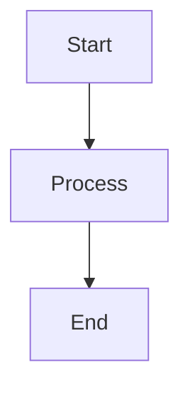

# SPEC-[short-name]

## 1. Metadata
- Status: Draft | Approved | Superseded
- Owner:
- Created:
- Related requirement:
- Related plan:

## 2. Goal

## 3. Background / Context

## 4. Current Behavior

## 5. Expected Behavior

## 6. Business Rules

## 7. System Flow

## 8. Input / Output Contract

## 9. Affected Modules

## 10. Data / API / Config Impact
- Data model:
- API contract:
- Config/env:

## 11. Edge Cases

## 12. Acceptance Criteria
Use testable Given/When/Then criteria.

## 13. Out of Scope

## 14. Open Questions

## 15. Approval
Reply `APPROVED` to approve this SPEC and continue to PLAN.
