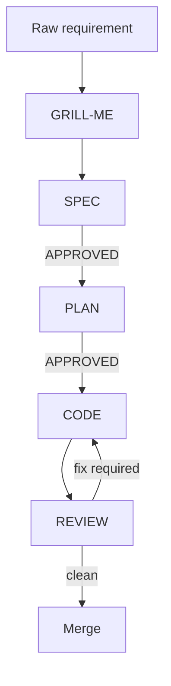

# ALEX AI Workflow

## Lifecycle

## Workflow Feedback & Controls
To navigate and give feedback between design phases, the user can issue the following directives (case-insensitive):
- **`APPROVED`**: Approves the current document/artifact (SPEC, PLAN, etc.) and transitions to the next phase (including coding after PLAN phase approval).
- **`REJECTED`**: Rejects the current draft. AI stops, halts execution, and asks if the user wants to re-analyze from scratch (y/n).
- **`RE-EXECUTE`** (also accepts `re-excute`): Requests re-execution and refinement. AI must not create a new SPEC or PLAN file, but instead edit and refine the existing file directly, asking clarifying questions if needed.

## Tool mapping
| Tool | Native files | Notes |
|---|---|---|
| Claude Code | `.claude/skills`, `.claude/commands`, `CLAUDE.md` | Skills are first-class. Commands are compatibility wrappers. |
| Gemini CLI | `.gemini/commands/*.toml`, `GEMINI.md` | TOML custom commands become slash commands. |
| Cursor | `.cursor/rules/*.mdc`, `.cursor/prompts/*.md` | Rules are persistent; prompts are fallback command templates. |
| Generic agents | `AGENTS.md`, `.agents/skills/**/SKILL.md` | Portable source of truth. |
