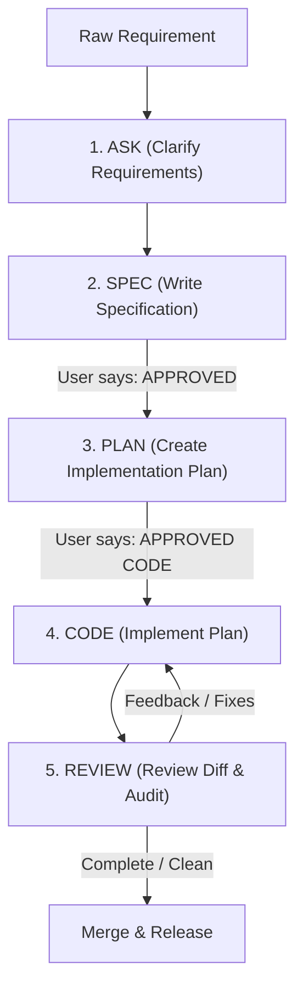

# ALEX AI Workflow Reference Guide

## 1. Purpose

The **ALEX AI Workflow** standardizes how development teams collaborate with **Claude Code** and **Gemini** across various repositories. By enforcing structured, quality-controlled development phases, it prevents hasty refactoring, misalignment of features, and structural regressions.



### The Golden Rule
> [!WARNING]
> **AI models (Claude/Gemini) are strictly prohibited from writing or modifying application source code directly from raw requirement descriptions.**
> All changes must go through the formal workflow: **ASK ➔ SPEC ➔ PLAN ➔ CODE ➔ REVIEW**.

---

## 2. Setup Guide

To apply this AI workflow to any repository, run the ALEX AI Workflow installer from the root directory of your target project.

### macOS / Linux / Git Bash
Execute the shell script installer:
```bash
/path/to/ALEX-ai-workflow-template/install-ai-workflow.sh
```

### Windows (PowerShell)
Execute the PowerShell installer (ensure execution policy allows running scripts):
```powershell
& "C:\path\to\ALEX-ai-workflow-template\install-ai-workflow.ps1"
```

---

## 3. Workflow Commands Reference

After installation, the workflow supports two different execution modes depending on your AI tool:

### A. Claude Code (Local Slash Commands)
Claude Code natively executes local slash commands configured under `.claude/commands/`:

| Command | Phase | Description | Key Output File |
| :--- | :--- | :--- | :--- |
| `/init-ai-workflow` | **Init/Repair** | Configures paths, scans stack, updates build/test commands in `CLAUDE.md`. | `CLAUDE.md` |
| `/ask` | **ASK** | Clarifies the raw request, lists edge cases, outlines assumptions, asks up to 5 questions. | Console Report |
| `/spec` | **SPEC** | Saves a structured technical spec with system flows and Mermaid. | `.ai/specs/SPEC-[name].md` |
| `/plan` | **PLAN** | Examines code, lists affected files, plans design steps. | `.ai/plans/PLAN-[name].md` |
| `/code` | **CODE** | Implements the planned changes. Runs ONLY after `APPROVED CODE` confirmation. | Source Files |
| `/review` | **REVIEW** | Audits the modified git diff for security, correctness, and performance. | Console Report |

### B. Gemini (Simulated Chat Prompts)
Since Gemini operates in IDE Sidebars, Google AI Studio, or Gemini Advanced, it does not have a CLI executor. Instead, Gemini **simulates slash commands** in chat:
1. Provide the **`GEMINI.md`** file instructions to Gemini in your chat session.
2. Trigger each phase by copying the contents of (or referencing using `@filename`) the templates in **`.gemini/prompts/`**:
   - `/init-ai-workflow` ➔ `.gemini/prompts/init-ai-workflow.md`
   - `/ask` ➔ `.gemini/prompts/ask.md`
   - `/spec` ➔ `.gemini/prompts/spec.md`
   - `/plan` ➔ `.gemini/prompts/plan.md`
   - `/code` ➔ `.gemini/prompts/code.md`
   - `/review` ➔ `.gemini/prompts/review.md`

### C. Antigravity / Agentic IDE Assistants (Native Chat Slash Commands)
For developers using **Antigravity**, the workflow is completely seamless and automated:
1. You **do NOT need to copy-paste** anything or reference template files.
2. Because Antigravity has full terminal and file-writing capabilities, you can type `/ask`, `/spec`, `/plan`, `/code`, `/review`, or `/init-ai-workflow` directly into your Antigravity chat box.
3. Antigravity will automatically load the appropriate template from `.gemini/prompts/` or `.claude/commands/`, execute the agentic actions, scan your codebase, create/update files, and report back the results in real-time.


---

## 4. Key Developer & AI Interaction Flow

Here is the conversation layout for a standard feature request:

### Step 1: Initialize (Optional)
Run `/init-ai-workflow` (or paste the `init-ai-workflow.md` prompt) to ensure all structures are correct.

### Step 2: Requirement Clarification
Initiate the task with `/ask <requirement>` (or use `ask.md`).
- The AI will parse your request and reply with a structured list of questions, assumptions, and edge cases.
- **Developer action**: Answer the questions to clear up any missing context.

### Step 3: Create the Specification
Run `/spec` (or use `spec.md`).
- The AI will create a comprehensive spec in `.ai/specs/SPEC-[short-name].md`.
- **Developer action**: Review the spec. If it satisfies the objective, reply:
  ```text
  APPROVED
  ```

### Step 4: Formulate the Plan
Run `/plan` (or use `plan.md`).
- The AI will inspect the codebase and generate a file-level implementation roadmap in `.ai/plans/PLAN-[short-name].md`.
- **Developer action**: Review the technical plan. If the files, logic, and test plans are correct, reply:
  ```text
  APPROVED CODE
  ```
  *(Important: Only this specific phrase allows the `/code` command to start modifying source code).*

### Step 5: Implementation
Run `/code` (or use `code.md`).
- The AI executes changes strictly matching the approved plan, runs build/test checks, and reports results.

### Step 6: Code Review & Audit
Run `/review` (or use `review.md`).
- The AI audits the git diff for security risks, bugs, and performance, giving you a checklist before merge.

---

## 5. Scope and Quality Controls

1. **Unrelated Refactoring**: Strictly prohibited. The AI must focus on the defined task.
2. **Public API & Database Schema Protection**: Any API signature changes or database migrations must be specifically approved in the SPEC and PLAN before they are introduced.
3. **Automated Testing**: Build and test scripts must be run frequently during development to avoid regressions.
4. **Safety Defaults**: If any technical constraint or architectural risk is found that violates initial planning, the model will pause, detail the issue, and wait for input.

