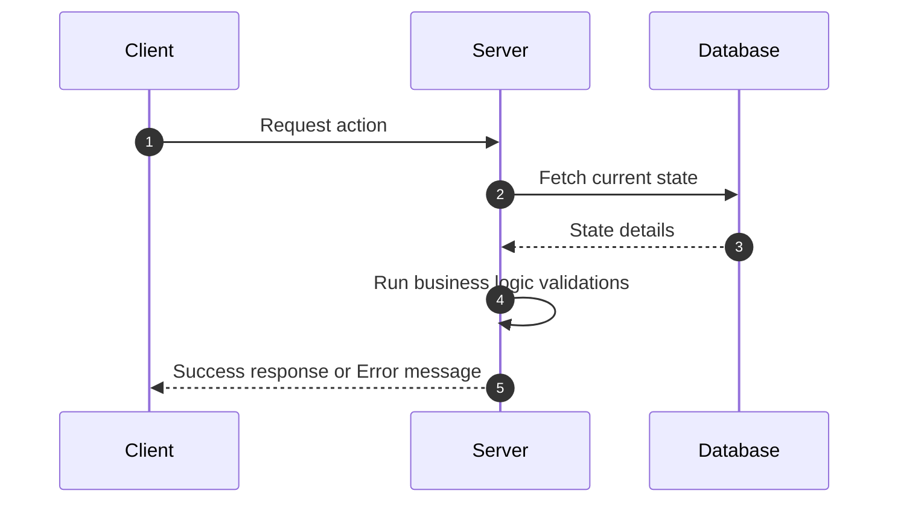

# SPEC-[feature-short-name]

*Instructions: Replace `[feature-short-name]` with a concise, lowercase, kebab-case name of the feature or bug (e.g. `SPEC-user-auth`, `SPEC-payment-gateway-cash`). Write clearly and avoid ambiguous language.*

## 1. Goal
*Explain the main goal of this specification. What problem are we solving? Who are the target users?*

## 2. Background / Context
*Describe the technical or business motivation. Link to relevant tickets, conversations, documentation, or historical context.*

## 3. Current Behavior
*Detail the existing behavior. How does the system act right now? (For new features, state: 'N/A - Feature does not exist yet.').*

## 4. Expected Behavior
*Describe the expected behavior. What does success look like? Outline exact UI states, system inputs/outputs, and successful user scenarios.*

## 5. Business Rules
*Detail constraints, policies, business logic, calculations, formatting rules, or permissions that govern this implementation.*
- **Rule 1**: e.g., "Users must be at least 18 years old to sign up."
- **Rule 2**: e.g., "Transactions exceeding $1000 require multi-factor authorization."

## 6. System Flow
*Illustrate the step-by-step technical execution flow. Use sequence, activity, or flowchart diagrams using Mermaid syntax where appropriate.*


## 7. Input / Output
*Describe API endpoints, data models, event payloads, CLI flags, database fields, or UI input fields.*
### Request Payload
```json
{
  "field": "value"
}
```
### Response Payload
```json
{
  "success": true,
  "data": {}
}
```

## 8. Affected Modules
*List existing files, classes, components, controllers, database tables, or services that will be affected by this change.*
- `ModuleA` (e.g., Auth service)
- `ModuleB` (e.g., Billing database schema)

## 9. Edge Cases
*Specify abnormal conditions, error recovery scenarios, missing inputs, network fallbacks, race conditions, or timeout management.*
- **No connection**: How should the system respond when database connection is dropped?
- **Invalid characters**: How to handle invalid inputs or edge case characters?
- **Race conditions**: What happens if two clients execute this action simultaneously?

## 10. Acceptance Criteria
*A strict list of testable conditions that must be completely satisfied before this feature is considered done.*
- [ ] **Scenario A**: Given [initial state], when [action is triggered], then [expected result].
- [ ] **Scenario B**: Given [invalid input], when [submission attempted], then [validation message is shown].

## 11. Out of Scope
*Specifically list elements that will NOT be touched or solved in this task. This is critical to control task boundaries.*
- *Unrelated Refactoring (e.g. refactoring database connection pools)*
- *Adding multi-currency support (reserved for phase 2)*

## 12. Open Questions
*List outstanding questions that require input but do not block the initial draft of this specification.*

---

*Once completed, prompt the user:*
> "Do you approve this SPEC? Reply **APPROVED** to continue to implementation planning."
