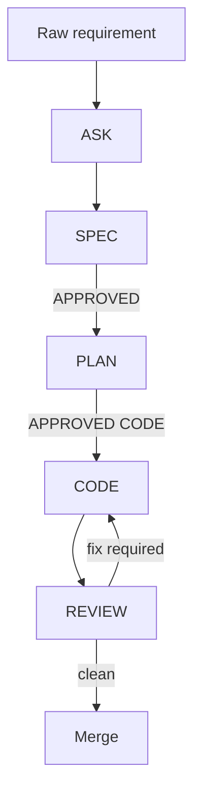

# ALEX AI Workflow

## Lifecycle

## Approval meanings
- `APPROVED`: approve current SPEC/PLAN artifact only.
- `APPROVED CODE`: authorize source code modifications according to approved PLAN.

## Tool mapping
| Tool | Native files | Notes |
|---|---|---|
| Claude Code | `.claude/skills`, `.claude/commands`, `CLAUDE.md` | Skills are first-class. Commands are compatibility wrappers. |
| Gemini CLI | `.gemini/commands/*.toml`, `GEMINI.md` | TOML custom commands become slash commands. |
| Cursor | `.cursor/rules/*.mdc`, `.cursor/prompts/*.md` | Rules are persistent; prompts are fallback command templates. |
| Generic agents | `AGENTS.md`, `.agents/skills/**/SKILL.md` | Portable source of truth. |
